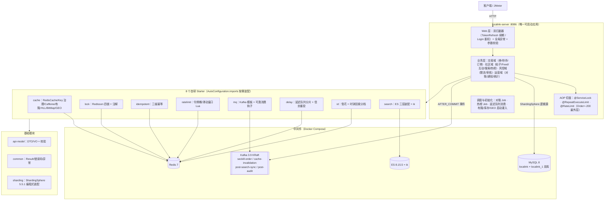
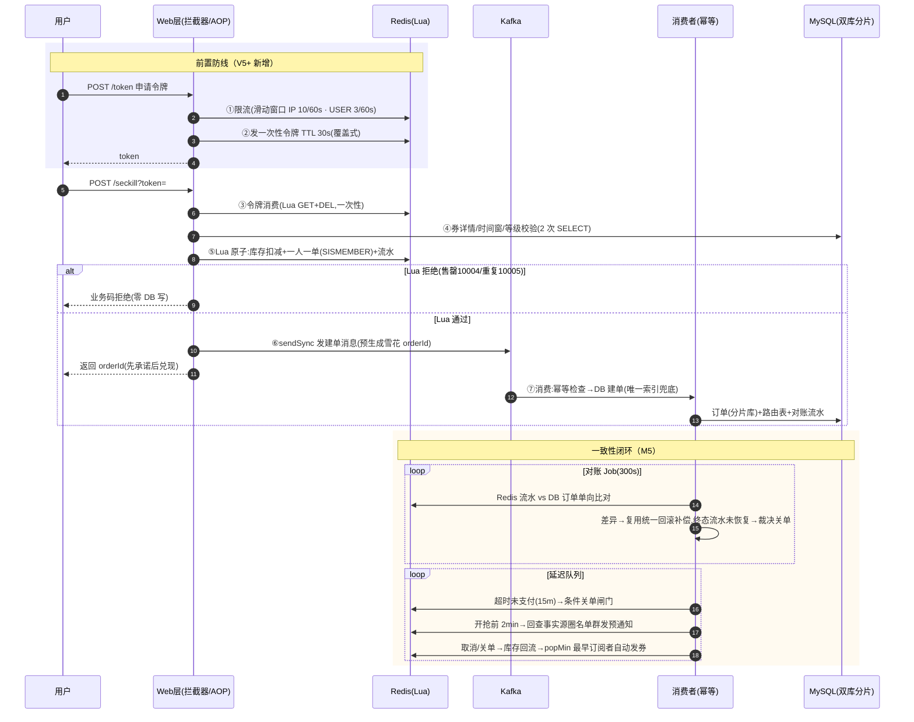

# Localink 架构设计文档

| 版本 | 日期 | 说明 |
|---|---|---|
| v1.0 | 2026-07-24 | 初版（M0.2 产出） |
| v2.0 | 2026-09-29 | M7-B 全面升版：mermaid 架构图、秒杀全链路含 M5 一致性闭环、社区链路（M6）、性能档案（M7-A）、选型与模块状态对齐现状 |

---

## 1. 架构总览

Localink 采用**单体应用 + 框架组件化**架构：一个可启动的业务应用（`localink-server`）+ 8 个自研 Spring Boot Starter 横切框架（全部实体化落地）。不做微服务拆分——业务规模不需要，且本项目的价值在组件深度而非服务数量。

**读数据走多级缓存**（L1 Caffeine → 布隆 → L2 Redis 逻辑过期 → DB），**写数据以 DB 为唯一事实源**，派生视图（Feed 收件箱 / ES / 热榜）全部可重建——这条"事实源 + 可重建"主线在项目里出现了三次。

## 2. Maven 模块划分（12 模块，全部落地）

| 模块 | 职责 | 状态 |
|---|---|---|
| `localink-common` | Result、分段错误码（0/1xxxx 券/2xxxx 用户/3xxxx 社区/4xxxx 框架/5xxxx 商户）、异常体系、常量 | ✅ M0 |
| `localink-api-model` | DTO/VO 载体 + jakarta.validation 校验注解（Long id 出参转字符串防精度丢失） | ✅ M0 |
| `localink-cache-starter` | RedisCache 封装、KeyManage 枚举治理、Caffeine 本地缓存、Redisson 布隆、HLL/BitMap/GEO 扩组（M6-F） | ✅ M2/M6 |
| `localink-lock-starter` | RedissonClient 封装、四种锁、@ServiceLock 注解 AOP、看门狗续期 | ✅ M3.3 |
| `localink-idempotent-starter` | @RepeatExecuteLimit 三级幂等（结果标记 + 本地排队 + 分布式公平锁） | ✅ M3.10 |
| `localink-ratelimit-starter` | 令牌桶/滑动窗口 Lua、场景化阈值与维度覆盖、限流 AOP | ✅ M3.13/14 |
| `localink-mq-starter` | Kafka 消息模型、生产者 sendSync / 消费者模板基类、发送/消费钩子 | ✅ M3.7/3.11 |
| `localink-delay-starter` | Redisson 延迟队列分片消费框架、StringCodec 信封重投（M5-B 加固） | ✅ M3.9/M5 |
| `localink-id-starter` | 雪花算法（时钟回拨分档）+ Redis Lua 轮转分配 workId | ✅ M4.1 |
| `localink-sharding` | ShardingSphere 5.5.1 编程式装配（避开 snakeyaml 兼容坑）、ds_0/ds_1 池参数可配（M7-A 透出） | ✅ M4.4/M7 |
| `localink-search-starter` | ES RestClient→Transport→Client 三层装配（client 钉 8.15.5）、索引/DSL 工具 | ✅ M6-D |
| `localink-server` | 唯一可启动业务应用（端口 **8086**），聚合全部 starter | ✅ |

**依赖规则**（单向、禁止循环）：starter 只依赖 `localink-common`（idempotent 例外可依赖 lock）；server 依赖全部 starter 与 api-model；各 starter 经 `META-INF/spring/...AutoConfiguration.imports` 自动装配，server 零配置引入。

## 3. 技术选型表

| 能力 | 选型 | 理由 | 备选（为什么不用） |
|---|---|---|---|
| 缓存 | Redis 7 + Redisson 3.52 | 生态成熟；Redisson 提供锁/布隆/延迟队列全家桶 | 自研 RedisTemplate 锁（语义不全） |
| 本地缓存 | Caffeine | 高性能、支持自定义过期策略 | Guava Cache（停止演进） |
| 消息队列 | Kafka 3.9（KRaft） | 高吞吐、acks=all+幂等生产者满足可靠性；大厂主流 | RabbitMQ（吞吐低）、Redis Stream（无持久化保障） |
| ORM | MyBatis-Plus 3.5.7 | 单表 CRUD 零 XML，复杂 SQL 可回退 XML | JPA（复杂场景控制力弱） |
| 分库分表 | ShardingSphere-JDBC **5.5.1** | 应用内集成无需运维中间件；5.3.2→5.5.1 升级实录见 [sharding.md](sharding.md) | MyCat（需独立部署） |
| 搜索 | Elasticsearch **8.15.5** + ik | 全文检索事实标准；索引 ik_max_word / 查询 ik_smart 不对称 | MySQL LIKE（不可用级性能） |
| 本地锁 | Caffeine 承载 ReentrantLock | 与本地缓存同组件，减少依赖 | ConcurrentHashMap 裸存（无过期清理） |
| JSON | fastjson2（缓存/内部）/ Jackson（Web 层） | 性能与泛型支持；Web 层保留 Spring 默认 | — |
| 压测 | JMeter 5.6.3 非 GUI | 参数化 JMX + 分位统计，三场景可复现 | wrk（生态与断言能力弱） |

## 4. 核心链路：秒杀全链路（V6 目标态）

### 六代演进表（每代解决上一代的具体问题，数字全部实测）

| 代 | 方案 | 实测结果 | 解决的问题 | 遗留的问题 |
|---|---|---|---|---|
| V1 (M3.1) | 纯 DB 事务下单 | QPS 88.8，300 并发 500 请求超卖 9 单 | — | 超卖、行锁串行 |
| V2 (M3.2) | 乐观锁 CAS（stock>0） | 超卖归零，QPS 62.5 | 超卖 | 高冲突下 CAS 重试风暴 |
| V3 (M3.5) | 分布式锁 + 唯一索引 | QPS 85.4，49 等锁超时 | 一人一单 | 锁粒度粗、吞吐回退 |
| V4 (M3.6) | Redis Lua 原子扣减 | 拒绝路径 Avg 113ms（快 20 倍），DB 写 300→100 | 热点行锁、无效 DB 写 | 成交路径仍同步建单 |
| V5 (M3.8) | Kafka 异步建单 | 稳态 168.4（+125%）、峰值吸收 847/s、Avg 233ms（-81%）、P99≈500ms | 同步 DB 事务拖垮 RT | 一致性债（欠单） |
| V6 (M7-A) | 全链路压测 + 参数调优 | **读路径 12310 QPS / 拒绝 5333 / 令牌拒绝 1630（P99 101ms）/ 400 并发成交 100% 正确率** | 拒连、爆池、消费排水慢 | 令牌拒绝路径受 Redis 往返主导（见 §8） |

演进叙事（面试线）：每一代不是推倒重来，而是把上一代"实测暴露的具体问题"修掉——V1 超卖催生 V2/V3 的正确性，V3 吞吐回退催生 V4 的前置拦截，V4 同步建单催生 V5 的异步化，V5 欠下的一致性债由 M5 闭环（幂等/对账/延迟关单）偿还，最终 V6 用压测把参数调到实处。

## 5. 社区链路（M6）

| 能力 | 设计要点 |
|---|---|
| Feed 流（M6-C） | 推拉结合：普通用户推模式（发帖事件 → 粉丝 ZSet 收件箱 `user:feed:{fanId}`），大 V（fans≥1000）不推、读时 DB 拉；读端归并去重。score = `毫秒时间戳<<12 \| 雪花低 12 位`（41+12=53 位位账保证同毫秒唯一），exclusive 游标（lastScore-1）滚动分页无重复无遗漏；收件箱 popMin 截断（默认 1024）控制写扩散上界 |
| 搜索（M6-D） | 发帖/删帖 AFTER_COMMIT 事件 → Kafka `post-search-sync`（key=postId 保同帖 FIFO，消息只带 postId+事件类型）→ 消费端查 DB 组装 → **upsert 天然幂等**；查询三段式（multi_match title^2 算分 + shopId 走 post_filter 保侧栏聚合 + search_after 深分页）；`rebuildAll` 全量重建兜底（DB 是事实源） |
| 热榜（M6-E） | score = (liked×5 + comments×3 + uv×1) × e^(-λΔt)，半衰期 72h 可配；**定时全量重算而非增量累计**（行为事实在事实源，写端零挂点零漂移）；浏览 UV 用 HLL 去重（12KB/键、误差 0.81%）；候选集 = 近 7 天新帖 ∪ 现役榜帖 |
| 两级审核（M6-F） | 信任分级：显性词库 HashMap Trie **同步初筛**（命中即拒、不落库、30001）+ 隐性词库 Kafka **异步复审**（命中驳回 → 复用删帖链路删 ES）；驳回走 AFTER_COMMIT 事件解耦 |
| 互动（M6-B） | 点赞事实表 + 计数同事务冗余 + ZSet 榜 afterCommit 异步维护；关注只建"我关注谁" Set 不建粉丝 Set（大 V 巨型集合走 DB 反查——拉模式伏笔）；共同关注 SINTER |

## 6. 关键横切设计约定

| 约定 | 规范 |
|---|---|
| Redis Key | 统一前缀 `lk:`，经 KeyManage 枚举 + KeyBuild 生成；秒杀三 key（stock/order/flow）同 `{voucherId}` hash tag 保证同槽位 |
| Kafka Topic | 统一前缀（4 个：seckill-order / cache-invalidation / post-search-sync / post-audit），分区数与消费并发对齐（3/3） |
| 锁命名 | `lk-lock:{类型前缀}:{业务名}:{SpEL 解析 key}` |
| 错误码 | 分段：0 成功；1xxxx 券域；2xxxx 用户；3xxxx 社区（首开 30001 审核拒）；4xxxx 框架（40002 未登录/40004 不存在/40008 限流）；5xxxx 商户 |
| 幂等键 | MQ 消息 UUID + 业务唯一键（userId+voucherId）双重保障；at-least-once × 幂等 = effectively-once |
| 事务事件 | 跨系统副作用（Kafka/ES/Feed 推送）一律 AFTER_COMMIT 触发，避免脏读未提交数据 |
| 时间/序列化 | 统一 LocalDateTime（`yyyy-MM-dd HH:mm:ss`）；Redis 全 String 序列化，对象值 fastjson2 |

## 7. 数据架构演进

| 阶段 | 形态 | 说明 |
|---|---|---|
| M1~M3 | 单库 `localink` | 快速跑通业务与中间件链路 |
| M4 | 双库 × 双表 | ShardingSphere-JDBC 5.5.1：订单域库按 user_id %2、表按 voucher_id %2；`lk_order_route` 路由表支持按 orderId 反查；其余 11 表 SINGLE 规则显式落 ds_0 |
| M6 | + ES 索引 | 帖子经 Kafka 同步至 ES（DB 为唯一事实源，可 rebuildAll 全量重建） |

详见 [database.md](database.md)（12 表 ER 与 Redis 常驻清单）、[sharding.md](sharding.md)（分片键取舍与 5.5.1 升级实录）。

## 8. 性能档案（M7-A 实测，2026-09-28）

**环境口径**：22 逻辑核 Win11 / JDK 21 / JMeter 5.6.3 非 GUI 单实例与服务**同机** / MySQL8+Redis7+Kafka3.9+ES8.15 全部 Docker Desktop(WSL2)。同机口径数字偏保守，如实声明。

| 场景（最优档） | 基线（默认参数） | 调优定稿 | 变化 |
|---|---|---|---|
| 缓存命中 @1000 线程 | 3966 QPS / P99 1186ms | **12310 QPS / P99 172ms** | +210% |
| 未登录拒绝 @300 | 3722 / P99 828 | **5333 / P99 461** | +43% |
| 无效令牌拒绝 @100 | 1549 / P99 95 | **1630 / P99 101** | 持平（Redis 往返主导） |
| 成功路径 400 并发 | 正确率 75%（94 拒连 + 5×爆池 500） | **800/800 = 100%** | 两缺陷归零 |

**调优参数定稿**（application.yml）：

| 参数 | 基线 | 定稿 | 依据 |
|---|---|---|---|
| server.tomcat.accept-count | 100（默认） | **1000** | 400 并发 rampup≤2s 冲刺 94 个 Connection refused（accept 队列打满） |
| localink.sharding.primary-pool.maximum-pool-size（ds_0，M7-A 透出） | 10（Builder 硬编码） | **30** | 爆池三联征：active=max=10、waiting=122、3s 超时→500 |
| ds_1 maximum-pool-size | 10 | **30** | 与 ds_0 对称 |
| spring.kafka.listener.concurrency | 1（默认） | **3** | 对齐 seckill-order 3 分区，峰值排水加速；测试 JVM 经 surefire 压回 10/1 防挤爆 MySQL 151 |
| server.tomcat.threads.max | 200（默认） | **维持 200** | 见下反例 |

**反例归档（threads.max 200→400 实验）**：缓存命中 +74%（8146 QPS，纯 CPU 短请求受益于并发度）；但未登录拒绝 -64%（3722→1329，P50 1ms / P90 844ms 双峰 = 调度饥饿）——**CPU 饱和场景线程翻倍是负优化**。按主口径（拒绝路径 + 全链路正确性）回退 200。结论：参数没有全局最优，只有"场景 × 目标"的最优；有反例的调优才可信。

**剩余瓶颈归因**：令牌拒绝路径 1630 的上限 = 每请求 2 次 Redis 往返（登录态 HGET+EXPIRE、令牌消费 Lua）在 WSL2 NAT 下的放大——对照零 Redis 的 40002 路径 5333 即差值；演进方向为命令合并/管线化。成交路径稳态 168 的瓶颈 = 校验链 2 次 DB SELECT（演进方向为券详情缓存化，属业务演进非参数调优）。

## 9. 部署形态

单机开发形态：单 JVM（localink-server:8086，`-Xmx2g`）+ Docker Compose 中间件（MySQL8 双库 / Redis7 / Kafka3.9 KRaft / ES8.15+ik）。完整部署手册见 **[deploy.md](deploy.md)**（含 SQL 双库初始化、构建启动、冒烟、初始化自检清单、ES 重建、压测复现入口）；中间件安装排障见 [middleware-setup.md](middleware-setup.md)。Web 前端（W 线）未启动，nginx 部署待 W4 落地后补充。

## 10. 风险与对策

| 风险 | 对策 |
|---|---|
| ~~ShardingSphere 5.3.2 与 SpringBoot3/snakeyaml 兼容问题~~ | 已升级 5.5.1 并改为编程式装配解决（`localink-sharding` 模块，实录见 [sharding.md](sharding.md)） |
| ES client 与 server 大版本漂移 | client 钉 8.15.5（Boot BOM 8.18 的 cluster.health 响应缺字段对 8.15.5 服务端解码失败——"同大版本兼容"翻车实录，M6-D） |
| Kafka 本地资源占用高 | KRaft 单节点 + NUM_PARTITIONS=3 + 按需 profile |
| 演进式开发导致早期代码被推翻 | 每代实现保留在独立方法/类中，作为压测对比素材而非删除；六代演进数字入档（§4） |
| 同机压测数字口径被质疑 | 报告如实声明环境；分场景报数；保留反例与瓶颈归因（§8） |
