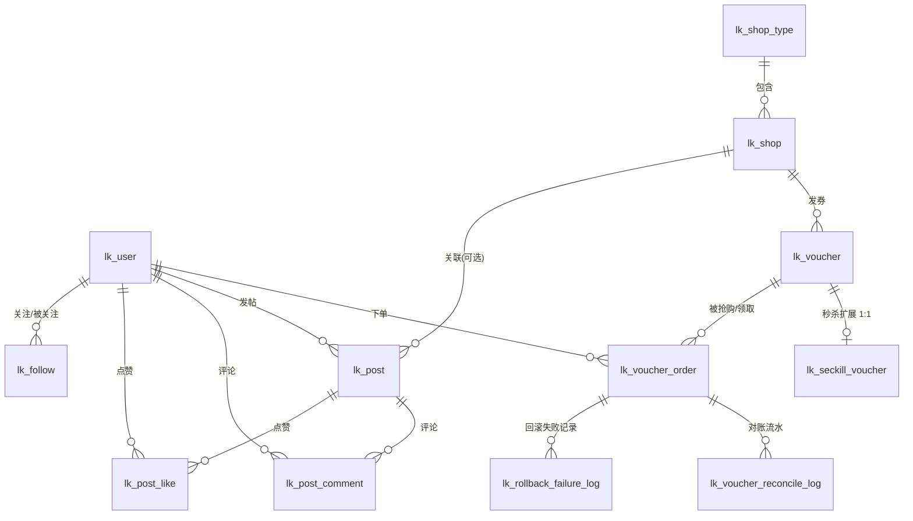

# Localink 数据库设计文档

| 版本 | 日期 | 作者 | 说明 |
|---|---|---|---|
| v1.0 | 2026-08-14 | ymy | 初版：单库 12 张表（M1.1 产出） |

---

## 1. 设计总览

### 1.1 数据库演进（对齐 architecture.md 第 6 节）

| 阶段 | 形态 | 说明 |
|---|---|---|
| M1~M3 | 单库 `localink` | 本文档的 12 张表全部落于单库，快速跑通业务与中间件链路 |
| M4 | 双库 `localink_0/1` | ShardingSphere-JDBC；仅订单域分片（库按 user_id、表按 voucher_id），新增订单路由表（M4.3 设计） |
| M6 | + ES 索引 | 帖子/商户经 Kafka 同步到 ES，DB 仍是唯一事实源 |

### 1.2 通用约定

| 约定 | 规范 | 理由 |
|---|---|---|
| 表前缀 | `lk_`（Localink） | 与参考项目 `tb_` 区分；库内一眼可辨归属 |
| 命名 | 表名/字段名一律 snake_case | MySQL 社区主流；MyBatis-Plus 驼峰自动映射 |
| 主键 | `id bigint unsigned`，雪花 ID（M1 用 MyBatis-Plus ASSIGN_ID，M4 起切自研 id-starter） | 不用 AUTO_INCREMENT——分库分表后自增 ID 失效，提前统一 |
| 时间 | `create_time` / `update_time` 一律 DATETIME，`update_time` 带 `ON UPDATE CURRENT_TIMESTAMP` | DATETIME 无 2038 上限、不带时区转换歧义；应用层统一 LocalDateTime（architecture.md §5） |
| 字符集 | utf8mb4 + utf8mb4_0900_ai_ci | MySQL 8 默认排序规则，支持 emoji（帖子/昵称场景） |
| 金额 | 一律 BIGINT，单位：分 | 避免浮点误差 |
| 外键 | 只留逻辑外键（字段 + 索引），不建物理 FOREIGN KEY | 互联网惯例：外键约束移入应用层，避免级联锁与分片阻碍 |
| 状态字段 | tinyint unsigned，枚举值从 1 开始（0 仅用于"未知/待处理"语义） | 与 Java 枚举对齐，各枚举类在 M1.2 随实体落地 |

## 2. ER 图

## 3. 表清单总览（12 张）

| # | 表名 | 域 | 用途 | 首次使用 | M4 分片计划 |
|---|---|---|---|---|---|
| 1 | lk_user | 账户 | 用户账号 + 资料 + 会员等级（单表合并） | M1.4 | 不分片 |
| 2 | lk_shop_type | 商户 | 商户类型字典 | M1.6 | 不分片 |
| 3 | lk_shop | 商户 | 商户信息（含经纬度，供 GEO） | M1.6 | 不分片 |
| 4 | lk_voucher | 优惠 | 券基础信息（普通/秒杀共用） | M1.7 | 不分片 |
| 5 | lk_seckill_voucher | 优惠 | 秒杀券扩展（库存/时间窗/等级门槛），与券 1:1 | M1.8 | 不分片 |
| 6 | lk_voucher_order | 交易 | 券订单（状态机：创建/取消/超时关闭） | M3.1 | 库按 user_id、表按 voucher_id |
| 7 | lk_post | 社区 | 帖子（探店分享，含审核状态） | M6.2 | 不分片 |
| 8 | lk_post_comment | 社区 | 评论（两级结构：一级 + 楼中楼） | M6.3 | 不分片 |
| 9 | lk_post_like | 社区 | 点赞事实表（DB 为事实源，Redis ZSet 做点赞榜） | M6.4 | 不分片 |
| 10 | lk_follow | 社区 | 关注关系 | M6.5 | 不分片 |
| 11 | lk_voucher_reconcile_log | 交易 | 对账流水（Redis 流水落 DB，三层对账中间层） | M3.12 | 跟随订单分片 |
| 12 | lk_rollback_failure_log | 交易 | 回滚终失败记录（人工/告警兜底） | M5.2 | 跟随订单分片 |

## 4. 表结构详解

### 4.1 lk_user（用户表）

对应需求：F-ACC-01/02/03。账号 + 资料 + 会员等级单表合并（取舍见第 6 节）。

| 字段 | 类型 | 空 | 默认 | 说明 |
|---|---|---|---|---|
| id | bigint unsigned | NO | 雪花 | 主键，用户 ID |
| phone | varchar(16) | NO | | 手机号，登录唯一凭证 |
| password | varchar(128) | YES | NULL | 密码（加密存储），当前仅验证码登录，字段预留 |
| nick_name | varchar(32) | NO | '' | 昵称，注册默认"用户{id}" |
| icon | varchar(255) | NO | '' | 头像 URL |
| city | varchar(64) | YES | '' | 城市 |
| introduce | varchar(128) | YES | NULL | 个人介绍 |
| gender | tinyint unsigned | YES | 0 | 0 未知 / 1 男 / 2 女 |
| birthday | date | YES | NULL | 生日 |
| level | tinyint unsigned | NO | 0 | 会员等级 0~9（秒杀人群圈选依据） |
| fans | int unsigned | NO | 0 | 粉丝数（关注/取关时增减，非实时精确） |
| followee | int unsigned | NO | 0 | 关注数 |
| create_time | datetime | NO | CURRENT_TIMESTAMP | 创建时间 |
| update_time | datetime | NO | CURRENT_TIMESTAMP ON UPDATE | 更新时间 |

索引：`PRIMARY KEY(id)`、`UNIQUE uk_phone(phone)`

### 4.2 lk_shop_type（商户类型表）

对应需求：F-SHOP-01。字典表，数据量 < 100。

| 字段 | 类型 | 空 | 默认 | 说明 |
|---|---|---|---|---|
| id | bigint unsigned | NO | 雪花 | 主键 |
| name | varchar(32) | NO | | 类型名称（美食/KTV/健身…） |
| icon | varchar(255) | YES | NULL | 图标 URL |
| sort | int unsigned | NO | 0 | 展示顺序，越小越靠前 |
| create_time | datetime | NO | CURRENT_TIMESTAMP | |
| update_time | datetime | NO | CURRENT_TIMESTAMP ON UPDATE | |

索引：`PRIMARY KEY(id)`

### 4.3 lk_shop（商户表）

对应需求：F-SHOP-01/02/03。M2 多级缓存的主角；经纬度供 M6.18 Redis GEO 灌数据。

| 字段 | 类型 | 空 | 默认 | 说明 |
|---|---|---|---|---|
| id | bigint unsigned | NO | 雪花 | 主键 |
| name | varchar(128) | NO | | 商户名称 |
| type_id | bigint unsigned | NO | | 类型 ID（逻辑外键 → lk_shop_type.id） |
| images | varchar(1024) | NO | | 图片 URL，多张逗号分隔 |
| area | varchar(128) | YES | NULL | 商圈 |
| address | varchar(255) | NO | | 详细地址 |
| longitude | double | NO | | 经度（GEO 用） |
| latitude | double | NO | | 纬度（GEO 用） |
| avg_price | bigint unsigned | YES | NULL | 人均价格，单位分 |
| sold | int unsigned | NO | 0 | 销量（展示计数） |
| comments | int unsigned | NO | 0 | 评价数（展示计数） |
| score | int unsigned | NO | 0 | 评分 1~5 分 ×10 存储（如 47=4.7），避免小数 |
| open_hours | varchar(32) | YES | NULL | 营业时间，如 10:00-22:00 |
| create_time | datetime | NO | CURRENT_TIMESTAMP | |
| update_time | datetime | NO | CURRENT_TIMESTAMP ON UPDATE | |

索引：`PRIMARY KEY(id)`、`KEY idx_type_id(type_id)`

### 4.4 lk_voucher（优惠券表）

对应需求：F-VOC-01。普通券与秒杀券共用的"券面信息"；秒杀属性下沉到扩展表（取舍见第 6 节）。

| 字段 | 类型 | 空 | 默认 | 说明 |
|---|---|---|---|---|
| id | bigint unsigned | NO | 雪花 | 主键，券 ID |
| shop_id | bigint unsigned | NO | | 所属商户（逻辑外键 → lk_shop.id） |
| title | varchar(255) | NO | | 标题 |
| sub_title | varchar(255) | YES | NULL | 副标题 |
| rules | varchar(1024) | YES | NULL | 使用规则 |
| pay_value | bigint unsigned | NO | | 支付金额，单位分（0=免费领取） |
| actual_value | bigint unsigned | NO | | 抵扣金额，单位分 |
| type | tinyint unsigned | NO | 1 | 1 普通券 / 2 秒杀券 |
| status | tinyint unsigned | NO | 1 | 1 上架 / 2 下架 / 3 过期 |
| create_time | datetime | NO | CURRENT_TIMESTAMP | |
| update_time | datetime | NO | CURRENT_TIMESTAMP ON UPDATE | |

索引：`PRIMARY KEY(id)`、`KEY idx_shop_status(shop_id, status)`（商户详情页"券列表"查询）

### 4.5 lk_seckill_voucher（秒杀券扩展表）

对应需求：F-VOC-01/02/03。与 lk_voucher 1:1；M3.6 起 stock 预热进 Redis，本表为库存事实源。

| 字段 | 类型 | 空 | 默认 | 说明 |
|---|---|---|---|---|
| id | bigint unsigned | NO | 雪花 | 主键 |
| voucher_id | bigint unsigned | NO | | 关联券 ID（逻辑外键 → lk_voucher.id） |
| init_stock | int unsigned | NO | | 初始库存（回源重建基准） |
| stock | int unsigned | NO | | 当前库存 |
| min_level | tinyint unsigned | NO | 0 | 参与所需最低会员等级（0=不限，人群圈选依据） |
| begin_time | datetime | NO | | 开抢时间 |
| end_time | datetime | NO | | 结束时间 |
| create_time | datetime | NO | CURRENT_TIMESTAMP | |
| update_time | datetime | NO | CURRENT_TIMESTAMP ON UPDATE | |

索引：`PRIMARY KEY(id)`、`UNIQUE uk_voucher_id(voucher_id)`

### 4.6 lk_voucher_order（券订单表）

对应需求：F-TRD-03/04/05/09。M3 秒杀核心写入表；M4 分片主角（库按 user_id、表按 voucher_id）。

| 字段 | 类型 | 空 | 默认 | 说明 |
|---|---|---|---|---|
| id | bigint unsigned | NO | 雪花 | 主键，即订单 ID（对外 orderId） |
| user_id | bigint unsigned | NO | | 下单用户 |
| voucher_id | bigint unsigned | NO | | 购买的券 |
| status | tinyint unsigned | NO | 1 | 1 已创建 / 2 用户取消 / 3 超时关闭（系统取消） |
| reconciliation_status | tinyint unsigned | NO | 1 | 对账状态：1 待处理 / 2 异常 / 3 不一致 / 4 一致（M3.12 起维护） |
| create_time | datetime | NO | CURRENT_TIMESTAMP | 下单时间 |
| close_time | datetime | YES | NULL | 关闭时间（取消/超时关闭时写入） |
| update_time | datetime | NO | CURRENT_TIMESTAMP ON UPDATE | |

索引：`PRIMARY KEY(id)`、`KEY idx_user_id(user_id)`（我的订单）、`KEY idx_voucher_id(voucher_id)`（按券统计）。

**一人一单唯一索引不在 M1 建立**：秒杀一人一单先由 Lua/分布式锁保障（M3.1~M3.6），M3.5 再评估唯一索引兜底方案（需处理"取消后再抢"语义），属演进设计的一环。

### 4.7 lk_post（帖子表）

对应需求：F-COM-01/06/07。探店分享帖；审核状态机由 M6.15/16 的 DFA + MQ 异步审核驱动。

| 字段 | 类型 | 空 | 默认 | 说明 |
|---|---|---|---|---|
| id | bigint unsigned | NO | 雪花 | 主键 |
| user_id | bigint unsigned | NO | | 作者 |
| shop_id | bigint unsigned | YES | NULL | 关联商户（探店帖可挂商户，可空） |
| title | varchar(255) | NO | | 标题 |
| images | varchar(2048) | NO | '' | 图片 URL，最多 9 张逗号分隔（M6.1 上传产出） |
| content | varchar(2048) | NO | | 正文 |
| liked | int unsigned | NO | 0 | 点赞数（冗余计数，事实源为 lk_post_like） |
| comments | int unsigned | NO | 0 | 评论数（冗余计数） |
| viewed | int unsigned | NO | 0 | 浏览 UV 快照（HyperLogLog 定时回写，供热榜计分，M6.12/13） |
| audit_status | tinyint unsigned | NO | 0 | 0 待审核 / 1 通过 / 2 驳回；Feed 仅展示 1 |
| create_time | datetime | NO | CURRENT_TIMESTAMP | |
| update_time | datetime | NO | CURRENT_TIMESTAMP ON UPDATE | |

索引：`PRIMARY KEY(id)`、`KEY idx_user_id(user_id)`、`KEY idx_create_time(create_time)`（Feed/分页）、`KEY idx_shop_id(shop_id)`

### 4.8 lk_post_comment（评论表）

对应需求：F-COM-01。两级结构：一级评论 parent_id=0；楼中楼 parent_id 指向一级评论、reply_id 指向被回复的楼中楼。

| 字段 | 类型 | 空 | 默认 | 说明 |
|---|---|---|---|---|
| id | bigint unsigned | NO | 雪花 | 主键 |
| post_id | bigint unsigned | NO | | 所属帖子 |
| user_id | bigint unsigned | NO | | 评论者 |
| parent_id | bigint unsigned | NO | 0 | 一级评论 ID；0 表示自身为一级评论 |
| reply_id | bigint unsigned | NO | 0 | 被回复的评论 ID；0 表示非回复 |
| content | varchar(512) | NO | | 评论内容 |
| liked | int unsigned | NO | 0 | 点赞数（评论点赞仅计数，不入榜） |
| audit_status | tinyint unsigned | NO | 0 | 同帖子审核状态机 |
| create_time | datetime | NO | CURRENT_TIMESTAMP | |
| update_time | datetime | NO | CURRENT_TIMESTAMP ON UPDATE | |

索引：`PRIMARY KEY(id)`、`KEY idx_post_time(post_id, create_time)`（详情页按时间盖楼）

### 4.9 lk_post_like（点赞表）

对应需求：F-COM-01。点赞事实表——DB 为事实源、Redis ZSet 为点赞榜加速层（取舍见第 6 节）。

| 字段 | 类型 | 空 | 默认 | 说明 |
|---|---|---|---|---|
| id | bigint unsigned | NO | 雪花 | 主键 |
| post_id | bigint unsigned | NO | | 帖子 ID |
| user_id | bigint unsigned | NO | | 点赞用户 |
| create_time | datetime | NO | CURRENT_TIMESTAMP | |

索引：`PRIMARY KEY(id)`、`UNIQUE uk_post_user(post_id, user_id)`（一人一赞）、`KEY idx_user_id(user_id)`

### 4.10 lk_follow（关注表）

对应需求：F-COM-02。

| 字段 | 类型 | 空 | 默认 | 说明 |
|---|---|---|---|---|
| id | bigint unsigned | NO | 雪花 | 主键 |
| user_id | bigint unsigned | NO | | 关注者（发起方） |
| follow_user_id | bigint unsigned | NO | | 被关注者 |
| create_time | datetime | NO | CURRENT_TIMESTAMP | |

索引：`PRIMARY KEY(id)`、`UNIQUE uk_user_follow(user_id, follow_user_id)`、`KEY idx_follow_user_id(follow_user_id)`（粉丝列表）

### 4.11 lk_voucher_reconcile_log（对账流水表）

对应需求：F-TRD-06。三层对账（Redis 流水 ↔ 本表 ↔ 订单）的中间层，M3.12 启用。trace_id 由 Lua 扣减时生成，串联流水、订单与回滚记录。

| 字段 | 类型 | 空 | 默认 | 说明 |
|---|---|---|---|---|
| id | bigint unsigned | NO | 雪花 | 主键 |
| order_id | bigint unsigned | NO | | 订单 ID |
| user_id | bigint unsigned | NO | | 下单用户（分片冗余键） |
| voucher_id | bigint unsigned | NO | | 券 ID |
| trace_id | bigint unsigned | NO | | 链路追踪 ID（Lua 生成） |
| message_id | varchar(64) | YES | NULL | Kafka 消息 UUID（消费幂等关联） |
| log_type | tinyint | NO | 1 | 1 扣减 / 2 恢复 |
| business_type | tinyint unsigned | NO | 1 | 1 下单成功 / 2 下单超时 / 3 下单失败 |
| before_qty | int | YES | NULL | 变动前库存 |
| change_qty | int | YES | NULL | 变动数量 |
| after_qty | int | YES | NULL | 变动后库存 |
| reconciliation_status | tinyint unsigned | NO | 1 | 1 待处理 / 2 异常 / 3 不一致 / 4 一致 |
| detail | varchar(1024) | YES | NULL | 差异说明 |
| create_time | datetime | NO | CURRENT_TIMESTAMP | |
| update_time | datetime | NO | CURRENT_TIMESTAMP ON UPDATE | |

索引：`PRIMARY KEY(id)`、`KEY idx_order_id(order_id)`、`KEY idx_trace_id(trace_id)`、`KEY idx_message_id(message_id)`

### 4.12 lk_rollback_failure_log（回滚失败日志表）

对应需求：F-TRD-05。Redis 回滚（DEL 库存 key 回源）指数退避重试终失败后落表，供告警与人工补偿，M5.2 启用。

| 字段 | 类型 | 空 | 默认 | 说明 |
|---|---|---|---|---|
| id | bigint unsigned | NO | 雪花 | 主键 |
| voucher_id | bigint unsigned | NO | | 券 ID |
| user_id | bigint unsigned | NO | | 用户 ID |
| order_id | bigint unsigned | YES | NULL | 订单 ID（建单前失败可空） |
| trace_id | bigint unsigned | YES | NULL | 链路追踪 ID |
| result_code | int | YES | NULL | Lua 返回码（对应 BaseCode 秒杀段） |
| retry_attempts | int | NO | 0 | 已重试次数 |
| source | varchar(64) | YES | NULL | 来源组件（如 seckill-rollback） |
| detail | varchar(1024) | YES | NULL | 失败详情 |
| create_time | datetime | NO | CURRENT_TIMESTAMP | |
| update_time | datetime | NO | CURRENT_TIMESTAMP ON UPDATE | |

索引：`PRIMARY KEY(id)`、`KEY idx_voucher_user(voucher_id, user_id)`、`KEY idx_trace_id(trace_id)`

## 5. 延后设计的表

| 表 | 所属迭代 | 说明 |
|---|---|---|
| lk_voucher_order_router（订单路由表） | M4.3 分片设计文档 | 订单按 voucher_id 分表后，按 orderId 反查所在库表需要路由表；分片键未定前设计它属于超前设计，随 M4.3 一并产出 |

## 6. 关键设计取舍

| # | 决策 | 备选方案 | 选择理由 |
|---|---|---|---|
| 1 | user 单表合并（账号+资料+等级） | 参考项目式三表拆分（user/user_info/user_phone） | 拆 user_info 是为按 user_id 分片用户、拆 user_phone 是分片后按手机号反查——本项目 M4 只分片订单域（architecture.md §6），用户表不分片，拆分只带来无意义的 1:1 join |
| 2 | voucher / seckill_voucher 1:1 拆分 | 单表 + type 区分，库存时间窗放同一行 | 普通券无库存/时间窗概念，合并会让半数行字段为空；秒杀库存是热点行，独立表便于 M3.6 预热与乐观锁演进，也隔离了券面查询与库存写入 |
| 3 | 主键雪花 BIGINT，禁用 AUTO_INCREMENT | 自增主键 | M4 分片后自增失效；M1 起统一雪花（MyBatis-Plus ASSIGN_ID），M4 无缝切自研 id-starter |
| 4 | 时间字段 DATETIME | TIMESTAMP | TIMESTAMP 有 2038 上限且受会话时区隐式转换影响；DATETIME 与应用层 LocalDateTime 语义一致 |
| 5 | 点赞建 DB 事实表 + Redis ZSet 榜单 | 纯 Redis（参考项目做法） | 纯 Redis 重启/故障丢点赞事实；DB 表保障可恢复，ZSet 只承担 TopN 排序加速。代价：点赞多一次 DB 写，演示场景可接受 |
| 6 | 对账/回滚失败两表随 M1.1 一次设计到位 | 用到时（M3.12/M5.2）再补 DDL | 结构在秒杀链路设计时已收敛（architecture.md §4），提前定稿避免迭代中途改表；M1.2 一次建全部 12 表，此后各迭代只写 DML 不再动 DDL |
| 7 | 路由表延后到 M4.3 | 现在就设计 | 路由表结构完全由分片键决定，分片键取舍（M4.3 的核心议题）未定前设计它是超前设计 |
| 8 | 签到/UV/订阅/Top买家/Feed收件箱/GEO 不建表 | 各建持久化表 | 见第 7 节：这些数据的读写形态天然是 Redis 结构（BitMap/HyperLogLog/ZSet/GEO），DB 表只会引入双写一致性问题；重启恢复由"DB 事实源重算"或"接受丢失"逐场景定义 |
| 9 | 秒杀等级门槛用 min_level 单阈值 | allowed_levels 白名单（逗号分隔等级列表） | 白名单表达力强但演示场景只需"≥某等级"；单阈值无解析成本、可走索引比较，人群圈选 SQL 一个 `>=` 完成 |
| 10 | 不建物理外键 | FOREIGN KEY 约束 | 分库分表后跨片外键不可行；约束前移到应用层 + 唯一索引兜底，从 M1 就养成习惯 |

## 7. Redis 常驻数据清单（不建 DB 表）

| 数据 | Redis 结构 | 所属迭代 | 恢复策略 |
|---|---|---|---|
| 短信验证码 | String + TTL | M1.3 | 丢失=重发，无损 |
| 登录会话 | Hash（token → 用户信息） | M1.4 | 丢失=重新登录，无损 |
| 商户/券缓存 | String（JSON）+ 空值 + 逻辑过期 | M2.3~M2.7 | 缓存而已，重建即可 |
| 秒杀库存/一人一单/流水 | Hash（hash tag 同槽位） | M3.6/M3.12 | DEL 回源 DB 重建（F-TRD-05） |
| 订阅到券提醒 | ZSet 排队 + Hash 状态 | M5.6 | 由 DB 券配置 + 用户订阅行为重放（M5.6 定义） |
| 点赞榜 TopN | ZSet | M6.4 | 由 lk_post_like 重算 |
| Feed 收件箱 | ZSet（推模式） | M6.6 | 拉模式兜底（M6.8 推挽结合） |
| 热榜 | ZSet 快照 | M6.14 | 定时任务重算 |
| 签到 | BitMap（user:{id}:sign:{yyyyMM}） | M6.17 | 丢失=签到记录丢失，接受（演示场景） |
| UV 统计 | HyperLogLog | M6.12 | 丢失=计数归零重累，接受 |
| 店铺 Top 买家 | ZSet（按日 key） | M5.8 | 由订单重算 |
| 附近商户 | GEO（商户经纬度副本） | M6.18 | 由 lk_shop 全量灌入 |

## 8. 需求覆盖核对

| 表 | 覆盖 PRD 需求 |
|---|---|
| lk_user | F-ACC-01/02/03（F-ACC-04/05 走 Redis，见第 7 节） |
| lk_shop_type / lk_shop | F-SHOP-01/02/03 |
| lk_voucher / lk_seckill_voucher | F-VOC-01/02/03（F-VOC-04 走 Redis） |
| lk_voucher_order | F-TRD-03/04/09 |
| lk_voucher_reconcile_log | F-TRD-06 |
| lk_rollback_failure_log | F-TRD-05 |
| lk_post / lk_post_comment / lk_post_like | F-COM-01/06/07 |
| lk_follow | F-COM-02 |
| （Redis 结构） | F-ACC-04/05、F-VOC-04、F-TRD-01/02、F-COM-03/04/05、F-OPE-01/02/03、F-SHOP-03(GEO) |
| （M4.3 路由表） | F-TRD-08 |
